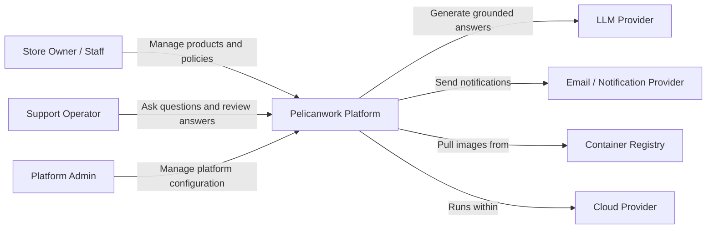

# Pelicanwork - System Context Diagram

## Purpose

Pelicanwork is an AI-enabled commerce knowledge and operations platform that helps store owners and support teams answer questions using product, FAQ, policy, and operational data.

## Primary Users

- Store owner
- Store staff
- Customer-support operator
- Platform administrator

## External Systems

- LLM Provider (OpenAI/Anthropic)
- Email/Notification Provider
- Container Registry (AWS ECR)
- Cloud Provider (AWS)

## System Context Diagram

## Architecture Decisions

1. **Java 21 + Spring Boot** - Matches professional background, strong enterprise ecosystem.
2. **Next.js + React** - Modern frontend with server/client components.
3. **PostgreSQL** - Relational data with vector extensions for AI.
4. **Microservices gradually** - Start small, extract services when boundaries are clear.
5. **REST + Kafka** - REST for synchronous, Kafka for asynchronous events.
6. **AWS EKS** - Managed Kubernetes for production.
7. **Terraform** - Infrastructure as code.
8. **Spring AI** - Java-native AI integration.